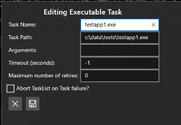

# Author and manage Factory Orchestrator TaskLists

Factory Orchestrator uses XML files to define TaskLists and their associated Tasks. An XML file can contain one or more TaskLists, each with any number of Tasks.

The XML can either be hand-authored; or authored, imported, and/or exported using the [Factory Orchestrator app's "Manage TaskLists"](#managing-tasklists) section.

You can get started with Factory Orchestrator by using the **Manage TaskLists** screen in the Factory Orchestrator app to create a TaskList. TaskLists allow you to create collections of tasks that you use to validate your hardware. The Factory Orchestrator app also allows you to export TaskLists for use on other systems. See [Managing TaskLists](#managing-tasklists) below.

This topic describes the tasks that are available in Factory Orchestrator, and how to create and manage TaskLists.

## Task types

Factory Orchestrator TaskLists allow adding different types of tasks:

- **Executable**

    These tasks are .exe files which are run directly. When you add this type of task, you can specify additional arguments and if the task should run as a background task.

- **Batch File**

    These tasks are .bat or .cmd files which are run by the command prompt (cmd.exe). When you add this type of task, you can specify additional arguments and if the task should run as a background task.

- **PowerShell**

    These tasks are .ps1 files which are run by PowerShell Core (pwsh.exe). When you add this type of task, you can specify additional arguments and if the task should run as a background task. Requires the `WCOS_POWERSHELLCORE` feature is included in your OEMInput.xml file.

- **TAEF**

    [TAEF tests](https://docs.microsoft.com/windows-hardware/drivers/taef/) can be added to a TaskList, and you can specify arguments and if the task should run as a background task.

- **UWP App**

    Allows you to run a UWP app as a task.

    UWP apps cannot take arguments (though you can use arguments to pass info to the operator about the goal of the Task), nor can they automatically return a pass/fail result. Instead, the operator must manually specify if the app passed or failed via a result prompt that the Factory Orchestrator App launches when the UWP app exits. You can also exit apps via ALT+F4 or Windows Device Portal.

    The Factory Orchestrator service can launch apps even if the Factory Orchestrator app isn't running.

    UWP App tasks will only run on DUTs booted into an environment that supports UWP apps.

- **External**

    These are tasks that require interaction from a technician before completing. These types of tasks could be used to tell a technician to connect a cable, check a device for scratches, move the device to the next station, etc.

    External Tasks can't automatically return a pass/fail result. The operator must manually specify if the Task passed or failed via a result prompt that the Factory Orchestrator App launches when the Task executes. External tasks will only run on devices that support displaying graphics. Devices configured to boot into a console that can't display graphics won't display external tasks.

    The operator must manually specify if the app passed or failed via a result prompt that the Factory Orchestrator App launches when the app exits, like is shown on this screen:  

    

    External tasks also support displaying custom images or video as part of the task. These images and videos are intended to allow external tasks to convey more information to technicians on the factory floor. When you create an external task, use **Arguments** to let the operator know what to expect or what actions to take. When you create an external task, use the **Image or Video Path:** field to specify an image or a video.

     

### Background tasks

A BackgroundTask is a type of Task which is not expected to return a pass/fail result. Instead, BackgroundTasks are started before any Tasks defined in the TaskList, and are not tracked by the Factory Orchestrator Service, though their output is logged to a file. BackgroundTasks are intended to be used for logging/monitoring tasks that need to be running before any Task in the TaskList executes.

BackgroundTasks are defined the exactly the same as a normal Task with the following exceptions:

- BackgroundTasks can only be an Executable, PowerShell, or BatchFile Task
- BackgroundTasks cannot have Timeout or MaxNumberOfRetries set

When editing a task from the Factory Orchestrator app, you can choose the option of making the task a background task by choosing the "Add as background task?" option.

## Managing TaskLists

Use the Factory Orchestrator app to manage a TaskList. TaskLists can be made up from a combination of the different task types. You can choose whether the tasks in the TaskList will be run one-at-a-time (series), or in parallel.

When you run Factory Orchestrator, you're presented with the 'Run TaskLists' tab. If you're opening the app for the first time, the app won't show any TaskLists. Once you create a TaskList, it will show on this screen.

Factory Orchestrator supports using environment variables (ex: %ProgramData%) in all commands.

To create, modify, and delete TaskLists, click on 'Manage TaskLists'.

### Create and manage TaskLists

The 'Manage TaskLists' tab in the Factory Orchestrator app allows you to create, modify, and delete TaskLists. 

#### Create or import TaskLists

- **Add a whole folder as a TaskList**

    Adds the contents of a local folder into a new TaskList. After you've added a folder, you can edit individual tasks to configure additional arguments, timeout settings, etc.

    

- **Choose individual files to add to a TaskList**

    Use `Create new TaskList` to create a new TaskList where you can individual tasks one-at-a-time to your TaskList. When you add tasks this way, you choose the type of task that you're adding and can configure arguments, timeout settings, etc as you add tasks.

    

- **Import a previously generated TaskLists XML file**

    This enables you to generate and export a TaskList on one device, and import it into your device. Once loaded, imported TaskList XML files can be modified like any other Task List.

    To import a TaskList:

    1. On the **Manage TaskLists** page, click on **Import FactoryOrchestratorXML file**

    

    2. Enter the full path to the FactoryOrchestratorXML you want to import and click ✓

    

    When you import a TaskList:
    
    - All the TaskLists defined in the file are imported
    - If the TaskList(s) were previously run, the TaskList state is also imported but not Task run results

When you create a new TaskList, the Factory Orchestrator app generates a GUID that it assigns as the TaskList's name.

#### Create and modify TaskLists

Once you've added tasks to a TaskList, you can click the pencil icon to modify as TaskList.


When you click the pencil icon, you'll see the following screen:


This screen allows you to create new Tasks, rename existing Tasks, reorder Tasks, or edit Tasks.

- Use the "New `<TaskType>` Task" buttons to create a new Task in the TaskList 

- Use the rename icon () to rename TaskLists

- Click and drag on the bars to the left of a Task to reorder the Tasks.

- Use the pencil (edit) button to edit a task. When you click the edit or "New `<TaskType>` Task" buttons, you'll see something similar to:

    

    See [FactoryOrchestratorXML](automate-factory-orchestrator.md) for information about the different options on this screen.

- Use the delete buttons to delete an existing Task.

#### Export TaskLists

If you create one or more TaskLists, you can export and save them. This allows you to add them onto another device. From the 'Manage TaskLists" screen:

- Save a single TaskList by clicking on the disk icon next to the TaskList name
- Save all your TaskLists by clicking on the button that says 'Save All TaskLists to XML File`

To export TaskLists:

Here is an image of the **Manage TaskLists** page with one TaskList loaded:


From this page, you can:

- Export a specific TaskList by clicking on the save icon (./images/save-icon.PNG) next to the Task
- Export all TaskLists by clicking on the **Save All TaskLists to File** button.

After you click one of these buttons, enter the full path of the file to save and click the (✓) to confirm.

## Special FactoryOrchestratorXML files

When it starts, the Factory Orchestrator service looks in `%DataDrive%\TestContent` for the following FactoryOrchestratorXML files that determine startup behavior:

| Filename              | Usage                                                                                                                                                                                        |
|-----------------------|----------------------------------------------------------------------------------------------------------------------------------------------------------------------------------------------|
| InitialTaskLists.xml  | These Factory Orchestrator TaskLists are loaded on first boot only. This file defines the default state of Factory Orchestrator, that is the TaskLists & tasks that are shown in the FO UI.  |
| FirstBootTasks.xml    | These TaskLists are run once, on the first boot of the DUT.                                                                                                                  |
| EveryBootTasks.xml    | These TaskLists are run on every boot of the DUT, including first boot. On first boot, it is always run after FirstBootTasks.                                                |

When Factory Orchestrator is running these tasks, you'll see a warning in the Factory Orchestrator UI:


**Notes**:

- The Factory Orchestrator Service does not allow communication with clients such as the Factory Orchestrator app until any `<Tasks>` defined in the relevant *BootTasks.xml files are done executing. 
- **DO NOT use External or UWP Tasks in these files**, as there is no way to mark those Tasks as completed without a connected Factory Orchestrator client. 
- While you can author normal `<Tasks>` in the *BootTasks.xml files, `<BackgroundTasks>` are very useful for the FirstBootTasks and EveryBootTasks XML files, as you can define `<BackgroundTasks>` which start on boot, aren't expected to ever exit, and will run in the background forever (provided `TerminateBackgroundTasksOnCompletion="false"`).
- You can inspect the [FactoryOrchestrator log files](factory-orchestrator.md#factory-orchestrator-logs) for details about the execution of these special FactoryOrchestratorXML files.

## Factory Orchestrator XML Schema

When hand-authoring FactoryOrchestratorXML files, you'll need to follow the FactoryOrchestratorXML schema. At the end of this topic, we've also provided a [sample FactoryOrchestratorXML file](#sample-factory-orchestrator-xml-file):

```XML
<?xml version="1.0" encoding="utf-8"?>
<xs:schema id="FactoryOrchestratorXML"
    elementFormDefault="qualified"
    xmlns:xs="http://www.w3.org/2001/XMLSchema"
    xmlns:xsi="http://www.w3.org/2001/XMLSchema-instance"
>
  <xs:element name="TaskRunGuids">
    <xs:complexType>
      <xs:sequence>
          <xs:element name="Guid" type="xs:string" minOccurs="1" maxOccurs="unbounded"/>
      </xs:sequence>
    </xs:complexType>
  </xs:element>
  
  <xs:complexType name="TaskType">
    <xs:all>
      <xs:element name="LatestTaskRunTimeStarted" type="xs:dateTime" minOccurs="0" maxOccurs="1"/>
      <xs:element name="LatestTaskRunTimeFinished" type="xs:dateTime" minOccurs="0" maxOccurs="1"/>
      <xs:element name="LatestTaskRunStatus" type="xs:string" minOccurs="0" maxOccurs="1"/>
      <xs:element name="LatestTaskRunExitCode" type="xs:int" minOccurs="0" maxOccurs="1"/>
      <xs:element name="TimesRetried" type="xs:int" minOccurs="0" maxOccurs="1"/>
      <xs:element ref="TaskRunGuids" minOccurs="0" maxOccurs="1"/>
    </xs:all>
    <xs:attribute type="xs:string" name="Name" use="optional"/>
    <xs:attribute type="xs:string" name="Path" use="optional"/>
    <xs:attribute type="xs:string" name="Guid" use="optional"/>
    <xs:attribute type="xs:string" name="Arguments" use="optional"/>
    <xs:attribute type="xs:int" name="MaxNumberOfRetries" use="optional"/>
    <xs:attribute type="xs:int" name="Timeout" use="optional"/>
    <xs:attribute type="xs:boolean" name="AbortTaskListOnFailed" use="optional"/>
    <xs:attribute type="xs:boolean" name="AutoPassedIfLaunched" use="optional"/>
    <xs:attribute type="xs:boolean" name="TerminateOnCompleted" use="optional"/>
  </xs:complexType>

  <xs:complexType name="TasksType">
    <xs:sequence>
      <xs:element name="Task" type="TaskType" minOccurs="1" maxOccurs="unbounded"/>
    </xs:sequence>
  </xs:complexType>
  
    <xs:element name="TaskList">
      <xs:complexType>
        <xs:sequence>
          <xs:element name="Tasks" type="TasksType" minOccurs="0" maxOccurs="1"/>
          <xs:element name="BackgroundTasks" type="TasksType" minOccurs="0" maxOccurs="1"/>
        </xs:sequence>
        <xs:attribute name="Name" type="xs:string" use="required"/>
        <xs:attribute name="Guid" type="xs:string" use="optional"/>
        <xs:attribute name="RunInParallel" type="xs:boolean" use="required"/>
        <xs:attribute name="AllowOtherTaskListsToRun" type="xs:boolean" use="required"/>
        <xs:attribute name="TerminateBackgroundTasksOnCompletion" type="xs:boolean" use="optional"/>
      </xs:complexType>
    </xs:element>
    <xs:element name="TaskLists">
      <xs:complexType>
        <xs:sequence>
          <xs:element ref="TaskList" minOccurs="1" maxOccurs="unbounded"/>
        </xs:sequence>
      </xs:complexType>
    </xs:element>
    <xs:element name="FactoryOrchestratorXML">
      <xs:complexType>
        <xs:sequence>
          <xs:element ref="TaskLists" minOccurs="1" maxOccurs="1"/>
        </xs:sequence>
      </xs:complexType>
    </xs:element>
  
</xs:schema>
```

### TaskList attributes

A TaskList element defines a Factory Orchestrator TaskList. The following defines that attributes of the `TaskList` element in the Factory Orchestrator XML schema.

| Attribute Name                        | Type    | Required?  | Details                                                                                                                                                                                          |
|---------------------------------------|---------|------------|--------------------------------------------------------------------------------------------------------------------------------------------------------------------------------------------------|
| Name                                  | String  | Y          | The "friendly name" of the TaskList.                                                  |
| Guid                                  | String  | N          | The GUID used to identify the TaskList. If not set, it will be assigned by the Factory Orchestrator Service automatically when the FactoryOrchestratorXML is loaded.                             |
| RunInParallel                         | Bool    | Y          | If "true", the Tasks in this TaskList are executed in parallel. If "false", the Tasks in this TaskList are executed in order, one at a time.                                                     |
| AllowOtherTaskListsToRun              | Bool    | Y          | If "false", while this TaskList is running all other TaskLists are blocked from executing. If "true", other TaskLists may execute while this TaskList is running.                                 |
| TerminateBackgroundTasksOnCompletion  | Bool    | N          | If "true", any BackgroundTasks defined in this TaskList are forcibly terminated when the TaskList's Tasks complete. If "false", any BackgroundTasks defined in this TaskList continue executing. Defaults to "true". |

#### Sample TaskList element

```xml
<TaskList Guid="15332a4b-ee08-4c97-a7ad-d69d4210c3a6" Name="List2" RunInParallel="true" AllowOtherTaskListsToRun="true" TerminateBackgroundTasksOnCompletion="true">
```

### Task attributes

A Task element defines a Factory Orchestrator Task. Tasks are pass/fail executables, apps, or jobs that are run as part of the TaskList that defines them. The following defines that attributes of the `Task` element in the Factory Orchestrator XML schema.

<!--Delete this table-->
| Attribute Name         | Type         | Required?    | Details                                                                                                                                                                                                                   |
|------------------------|--------------|--------------|---------------------------------------------------------------------------------------------------------------------------------------------------------------------------------------------------------------------------|
| xsi:type               | See details  | Y            | The type of the Task. Allowed values are: ExecutableTask, PowerShellTask, BatchFileTask, TAEFTest, UWPTask, and ExternalTask.                                                                                             |            
| Name                   | String       | N            | The "friendly name" of the Task. If not set, it will be assigned by the Factory Orchestrator Service automatically when the FactoryOrchestratorXML is loaded, based on the Task type and other attributes.                |            
| Guid                   | String       | N            | The GUID used to identify the Task. If not set, it will be assigned by the Factory Orchestrator Service automatically when the FactoryOrchestratorXML is loaded.                                                          |            
| Path                   | String       | Depends      | See the [Path table below](#path-definitions) to see which Tasks require you to include a Path element.  |                                                                                                                                     |            
| Arguments              | String       | N            | For Executable, PowerShell, BatchFile, and TAEF Tasks: this is the list of arguments to provide to the executable you specified in the "Path".<br><br>   For UWP Tasks: this can be used to provide details about the Task to the client. It is NOT passed to the UWP app.<br><br>For External Tasks: this can be used to provide details about the Task to the client.       |
| Timeout                | Int          | N            | In seconds, the amount of time to wait for the Task to be completed. Defaults to "-1" (infinite).<br><br> If "-1", the Task will never timeout.<br><br>If the timeout is reached, the Task status is set to "Timeout", a failed state. The Task's executable is also forcibly terminated (if it has one).                                                                                                                        |
| MaxNumberOfRetries     | Int          | N            | The number of times the Task should automatically be re-run if it completes in a failed state (Aborted/Failed/Timeout). Defaults to "0" (do not retry).<br><br>For example, if this is set to "2", the Task could be run up to 3 times automatically.                                                                         |
| AbortTaskListOnFailed  | Bool         | N            | If "true", if the Task is run during a TaskList and the Task fails (Aborted/Failed/Timeout), the TaskList is aborted in its current state. Any other pending or running Tasks will be aborted.<br><br>This action takes place after any re-runs specified by MaxNumberOfRetries.<br><br>While allowed, it is not recommended to use this for "RunInParallel" TaskLists, as the execution order of such a TaskList is not guaranteed, and Tasks may be aborted mid-execution.                                    |            
| TerminateOnCompleted   | Bool         | N            | By default, an app is terminated when the UWPTask completes. Set to false to not terminate after a UWPTask completes.  TerminateOnCompleted is ignored if AutoPassedIfLaunched=`true` |
| AutoPassedIfLaunched   | Bool         | N            | By default, a UWPTask waits for its TaskRun to be completed by a Factory Orchestrator Client. Setting this to true marks the UWP task completed when the app is launched. |

#### Path definitions

| Task type | Required | Path definition |
| --- | --- | --- |
| Executable  | Yes |   The path to the executable file that should be executed for this Task. |
| PowerShell | Yes | The path to the PowerShell file that should be executed for this Task. |
| BatchFile | Yes | The path to the Batch file that should be executed for this Task. |
| TAEF | Yes | The path to the TAEF test that should be executed for this Task. |
| UWP | Yes | the PackageFamilyName of the app you wish to launch. The PackageFamilyName is found in the package.appxmanifest for your app. It is also shown on the Factory Orchestrator app's "UWP Apps" page. |
| External | No | This is optional, but can be used to provide details about the Task. |

#### Sample Task element

```xml
<Task xsi:type="ExecutableTask" Name="Exe with abort tasklist on fail" Path="%DataDrive%\TestContent\testapp4.exe" Arguments="" Guid="6279616a-345d-4469-bba0-fd019c78b531" AbortTaskListOnFailed="true"/>
```

#### Validate Factory Orchestrator XML

You can validate FactoryOrchestratorXML using the Factory Orchestrator app on a technician PC.

1. Install the Factory Orchestrator app on a technician PC and launch it. 
2. Click "Validate FactoryOrchestratorXML" in the bottom left of the app.
3. Browse to the path of your FactoryOrchestratorXML file and click open. 
4. The FactoryOrchestratorXML file will be validated against the schema. Because this validation happens on the technician PC, it will only catch XML syntax errors not Factory Orchestrator Service errors such as duplicate GUIDs or invalid file paths. 

    - If the FactoryOrchestratorXML is valid you will see a success message saying that "FactoryOrchestratorXML was successfully validated."

    - If the FactoryOrchestratorXML is invalid, you'll see a message that says "FactoryOrchestratorXML failed validation", with a description of why it failed validation.

### Background tasks

A Background Task is a type of Task which is not expected to return a pass/fail result. Instead, Background Tasks are started before any Tasks defined in the TaskList, and are not tracked by the Factory Orchestrator Service, though their output is logged to a file. Background Tasks are intended to be used for logging/monitoring tasks that need to be running before any Task in the TaskList executes.

Background Tasks are defined as children of the `<BackgroundTasks>` element. That element can have any number of child `<Task>` elements which are run as Background Tasks.

The `TerminateBackgroundTasksOnCompletion` attribute on the owning TaskList determines if the Background Tasks are forcibly terminated when the TaskList is done executing.

Background Tasks are defined the exactly the same as a normal Task with the following exceptions:

- Any Executable, PowerShell, or Batch File Task can be made a Background Task.
- Background Tasks cannot have Timeout or MaxNumberOfRetries set

#### Sample BackgroundTasks element

```xml
<BackgroundTasks>
    <Task xsi:type="ExecutableTask" Name="Background Monitor" Path="%DataDrive%\TestContent\SomeBackgroundProcess.exe" Arguments="" Guid="34d3827c-6397-411f-85a6-7e92dca5f364"/>
</BackgroundTasks>
```

## Sample Factory Orchestrator XML file

The following sample FactoryOrchestratorXML file shows two TaskLists containing various types of tests, as well as a BackgroundTask that is part of the first TaskList.

```xml
<?xml version="1.0" encoding="utf-8"?>
<FactoryOrchestratorXML xmlns:xsi="http://www.w3.org/2001/XMLSchema-instance" xmlns:xsd="http://www.w3.org/2001/XMLSchema">
  <TaskLists>
  <!-- RunInParallel = all tasks can be executed simultaneously. AllowOtherTaskListsToRun = other tasklists can run in parallel with this one. TerminateBackgroundTasksOnCompletion = Any still running background tasks are forcefully terminated when all tasks complete -->
    <TaskList Guid="15332a4b-ee08-4c97-a7ad-d69d4210c3a5" Name="List1" RunInParallel="false" AllowOtherTaskListsToRun="true" TerminateBackgroundTasksOnCompletion="true">
      <Tasks>
        <!-- When a UWPTask is launched from Factory Orchestrator, the Factory Orchestrator app will prompt the user for the result of the app after it terminates. -->
        <!-- UWPTasks require Factory Orchestrator app is running! -->
        <Task xsi:type="UWPTask" Name="Launch app directly via FO (exit with ALT+F4)" Path="Microsoft.FactoryOrchestratorApp_8wekyb3d8bbwe" Arguments="" Guid="6ec52ded-e455-44cb-b861-b8d78996db95"/>
        <Task xsi:type="TAEFTest" Name="TAEF test" Path="%DataDrive%\TestContent\taeftest1.dll" Arguments="" Guid="ff908b05-e491-4a6e-9305-793b3c2d7f97"/>
        <Task xsi:type="ExecutableTask" Name="Exe with 5 retries" Path="%DataDrive%\TestContent\testapp1.exe" Arguments="" Guid="d75f7c9c-8de9-4d0f-b6dc-d2a51d8818cb" MaxNumberOfRetries="5"/>
        <Task xsi:type="ExecutableTask" Name="Exe with 10 second timeout" Path="%DataDrive%\TestContent\testapp2.exe" Arguments="" Guid="7ffd4516-b092-4f22-beec-f12c814f50dc" Timeout="10"/>
        <Task xsi:type="ExecutableTask" Name="Exe with arguments" Path="%DataDrive%\TestContent\testapp3.exe" Arguments="-arg1 abc -arg2 def" Guid="186e4b74-280f-45ca-a73b-a0b342fa1cb8" />
        <Task xsi:type="ExecutableTask" Name="Exe with abort tasklist on fail" Path="%DataDrive%\TestContent\testapp4.exe" Arguments="" Guid="6279616a-345d-4469-bba0-fd019c78b531" AbortTaskListOnFailed="true"/>
        <Task xsi:type="BatchFileTask" Name="Cmd/Batch file with arguments" Path="%DataDrive%\TestContent\cmdfile.cmd" Arguments="-arg1 abc" Guid="cf334ad7-4480-4915-b84c-2a38c84b4e8c"/>
        <Task xsi:type="PowerShellTask" Name="RunAppViaDevicePortal.ps1 (PowerShell Core, exit app with ALT+F4)" Path="%DataDrive%\TestContent\RunAppViaDevicePortal.ps1" Arguments="-AppId Microsoft.FactoryOrchestratorApp_8wekyb3d8bbwe!App" Guid="1f596b55-7c9b-4e71-97b4-a0c93c098a86"/>
        <!-- When a ExternalTask is launched from Factory Orchestrator, the Factory Orchestrator app will prompt the user for the result of task -->
        <Task xsi:type="ExternalTask" Name="External Task (No executable code or app)" Path="User interaction required" Arguments="Plug in power cord" Guid="f90ba40d-4982-46dc-b9a2-c1cd7900fef7" AbortTaskListOnFailed="true"/>
      </Tasks>
      <!-- Background Tasks are started before any other task in the TaskList, they are intended for processes that you want running throughout the entire tasklist, ex: a monitor or logging program -->
      <!-- BackgroundTasks can be ExecutableTask, BatchFileTask, or PowerShellTask -->
      <BackgroundTasks>
        <Task xsi:type="ExecutableTask" Name="Background Monitor" Path="%DataDrive%\TestContent\SomeBackgroundProcess.exe" Arguments="" Guid="34d3827c-6397-411f-85a6-7e92dca5f364"/>
      </BackgroundTasks>
    </TaskList>
    <!-- FactoryOrchestratorXML can contain multiple tasklists, so you can define your entire factory flow in one file, if desired. -->
    <TaskList Guid="15332a4b-ee08-4c97-a7ad-d69d4210c3a6" Name="List2" RunInParallel="true" AllowOtherTaskListsToRun="true" TerminateBackgroundTasksOnCompletion="true">
      <Tasks>
        <Task xsi:type="ExecutableTask" Name="Exe in another tasklist" Path="%DataDrive%\TestContent\testapp5.exe" Arguments="" Guid="45945e43-d251-4c97-a9ad-63cd52b09801"/>
      </Tasks>
    </TaskList>
  </TaskLists>
</FactoryOrchestratorXML>
```
