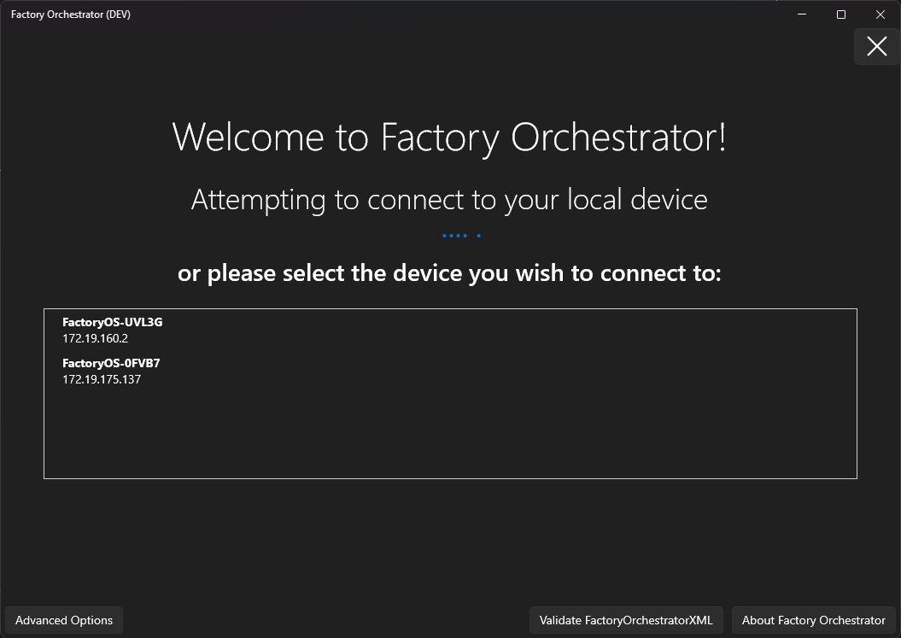

# Find devices running Factory Orchestrator on your local network
The Factory Orchestrator service supports [DNS Service Discovery](http://www.dns-sd.org/) (DNS-SD), which allows you to easily to query your local network for devices running the Factory Orchestrator service with [network access enabled](service-configuration.md#network-access)! (If network access is not enabled, the service does not advertise to DNS-SD.)

## Use the app
The Factory Orchestrator Windows app can list all devices running Factory Orchestrator service on your network. This only works if the Factory Orchestrator service is **not** running on the PC the app is launched on.

## Use FindDevice
FindDevice is an open source, cross-platform, .NET command line tool that you can use to look for devices running Factory Orchestrator service via DNS-SD. You can view the source code and/or download it at [https://github.com/microsoft/FindDevice/](https://github.com/microsoft/FindDevice/).

## Use PowerShell or C# code
It's super easy to find devices running Factory Orchestrator using the Microsoft.FactoryOrchestrator.Client C# library and/or PowerShell module! See [Find devices running Factory Orchestrator on the client usage samples page](factory-orchestrator-client-usage-samples.md)!

## DNS-SD details
Factory Orchestrator service instances advertise under `<HostName>_factorch._tcp.local`, with the port the service uses (by default 45684) contained in the SRV record. The TXT records contain additional properties:

| Property        | Details  |
|---------------------|------|
| OSVersion | A string representing the OS & its version. |
| ServiceVersion | A string representing the version of Factory Orchestrator service.  |