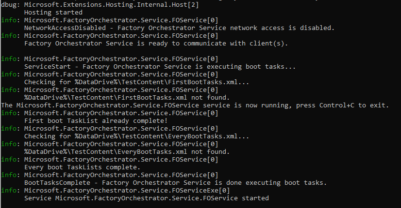
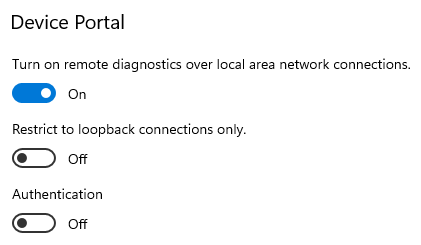

# Get started with Factory Orchestrator

## Install the service
**The service can be downloaded from the [GitHub releases page](https://github.com/microsoft/FactoryOrchestrator/releases).**

The Factory Orchestrator service (Microsoft.FactoryOrchestrator.Service) runs on your device under test (DUT) and acts as the engine powering Factory Orchestrator. To interact with the service, you can use the Factory Orchestrator [Windows app](use-the-factory-orchestrator-app.md) or [programmatically using the Factory Orchestrator client APIs](use-the-factory-orchestrator-api.md). Multiple clients can be connected to the same service simultaneously.

Once installed, the service can either be started manually (on demand) or configured to automatically start every boot.

 

### Install the service on Windows
[Download](https://github.com/microsoft/FactoryOrchestrator/releases) and unzip the service for 'win'(dows) and your target architecture. Then use an Administrator PowerShell to run the included InstallFactoryOrchestratorService.ps1 file. If you want the service to start automatically every boot, use the -AutoStart switch. Without this switch the service must be started manually every boot.

```PowerShell
    # Optionally, set its start up to automatic with: -AutoStart
    # Optionally, choose the installation directory with: -DestinationPath
    .\InstallFactoryOrchestratorService.ps1 # -AutoStart -DestinationPath C:\FactoryOrchestrator
```

#### Execution Policy
If you see the following error, you need to set your ExecutionPolicy to RemoteSigned.

```PowerShell
File InstallFactoryOrchestratorService.ps1 cannot be loaded because running scripts is disabled on this system.
For more information, see about_Execution_Policies at https://go.microsoft.com/fwlink/?LinkID=135170.
```

Run the following command to temporarily allow you to run the install script:
```powershell
    # Temporarily allow your PC to run signed scripts
    Set-ExecutionPolicy RemoteSigned -Scope Process

    # Then, you can install the service!
    .\InstallFactoryOrchestratorService.ps1 # -AutoStart
```

#### Start the service manually on Windows
To start the service manually, run the following from an administrator PowerShell:

```PowerShell
     Start-Service -Name "Microsoft.FactoryOrchestrator"
```

#### Windows UWP app support
If you want Factory Orchestrator to be able to install, launch, or exit Windows Store/UWP apps, your device must support running UWP apps and [Windows Device Portal](https://docs.microsoft.com/en-us/windows/uwp/debug-test-perf/device-portal) must be running on the device with [HTTP enabled & no authentication](https://docs.microsoft.com/en-us/windows/uwp/debug-test-perf/device-portal-desktop#turn-on-windows-device-portal).
 

### Install the service on Linux
[Download](https://github.com/microsoft/FactoryOrchestrator/releases) and unzip the service for 'linux' and your target architecture. Then run the included InstallFactoryOrchestratorService.sh file with bash as sudo. If you want the service to start automatically every boot, add an "enable" argument. Without this the service must be started manually every boot.

```Bash
     ## Optionally set its start up to automatic with: enable
    sudo bash ./InstallFactoryOrchestratorService.sh # enable
```

The install script requires the ["unzip"](https://linuxize.com/post/how-to-unzip-files-in-linux/#installing-unzip) command. If you prefer to use another command to unzip a .zip file, edit InstallFactoryOrchestratorService.sh, replacing "unzip" with your desired command.

#### Start the service manually on Linux
To start the service manually, run the following from bash:

```Bash
    sudo systemctl start Microsoft.FactoryOrchestrator.service
```

### Service configuration
See [Service configuration](../service-configuration) for details on how you can configure the Factory Orchestraor service's default behavior, including enabling network access so you can communicate with the service over your local network.

## Install the app

You can install the Factory Orchestrator app on your DUT or on a technician PC running Windows. The app can be downloaded from the [GitHub releases page](https://github.com/microsoft/FactoryOrchestrator/releases).

To install the app, run the .msixbundle to install the app. Alternately, use [Windows Device Portal](https://docs.microsoft.com/en-us/windows/uwp/debug-test-perf/device-portal) to install the app on your DUT. The app on the GitHub releases page is signed by Microsoft and does not require a certificate file to install.

## Run the app

To run the Factory Orchestrator app, use the Start menu to launch "Factory Orchestrator". Alternately, use [Windows Device Portal](https://docs.microsoft.com/en-us/windows/uwp/debug-test-perf/device-portal) to run the app:

1. Connect to the device where the app is installed with Device Portal
2. From Device Portal's Apps manager tab, choose `Factory Orchestrator (App)` from the Installed Apps list.
3. Click Start

The Factory Orchestrator app will start on the PC. If the PC has the Factory Orchestrator service running, it will automatically connect to the service. If not, you will be prompted to enter the IPv4 address of the service you wish to connect to.

See [Run using the application](use-the-factory-orchestrator-app.md) for details on how to use the app.
