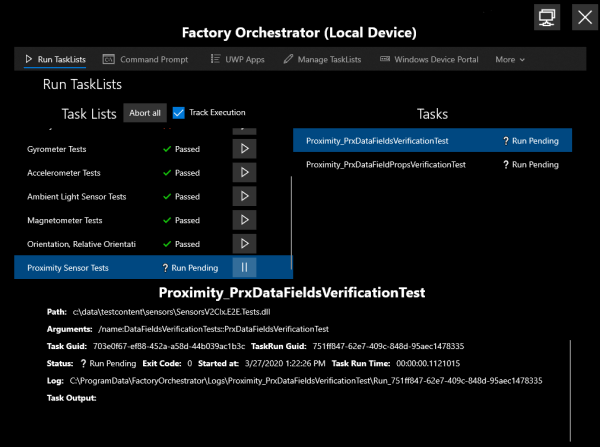

# Factory Orchestrator
<table><tr>
    <td></td>
    <td></td>
</tr></table>

Built to allow device manufacturers and developers to focus more on their validation and calibration software, and less on how to run, audit, and manage the lifecycle of their programs, Factory Orchestrator is a .NET Core cross-platform system service for organizing, executing, and logging a set of executable scripts, binaries, or ["Tasks"](tasks-and-tasklists.md) on a system. Factory Orchestrator tracks task information, including run unique per-run results and logging; even persisting task state to allow the service to be resilient to data loss due to system failure.

Factory Orchestrator also provides an optional [client app](use-the-factory-orchestrator-app.md) for Windows and a [robust client API surface](use-the-factory-orchestrator-api.md) for clients to monitor & interact with the service via the App or C# .NET, C# UWP, or PowerShell code. The app and and any other client can communicate with any Factory Orchestrator service running on the same system and/or over a network to a remote [device under test (DUT)](https://en.wikipedia.org/wiki/Device_under_test)!

Factory Orchestrator is a simple and reliable way to run validation or calibration software on your device under test on a manufacturing line. Factory Orchestrator makes auditing and fault analysis simple by providing durable and easily identifiable 'per run' results and logs. Beyond the factory floor, Factory Orchestrator can be used during device development to support various developer inner-loop and diagnostics activities enabling further reuse of collateral created and leveraged across the full device manufacturing lifecycle.

For a very light-hearted take on the power of Factory Orchestrator, watch the video below! (Caution: has audio at the end.)

<blockquote class="twitter-tweet" data-conversation="none">
 <a href="https://t.co/yS19cxUjfd">pic.twitter.com/yS19cxUjfd</a>
&mdash; Jake Friedman (@spaceisfunn) <a href="https://twitter.com/spaceisfunn/status/1367594898468139015?ref_src=twsrc%5Etfw">March 4, 2021</a></blockquote> 

See [Get started with Factory Orchestrator](get-started-with-factory-orchestrator.md) for details on how to install and run the app and/or service.