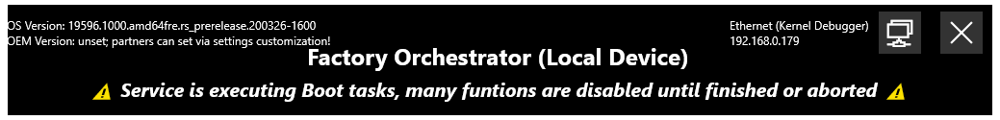

# Factory Orchestrator service configuration using appsettings.json
The Factory Orchestrator service has many configurable settings that impact its startup behavior, enabled features, and more. This configuration is easily modified using an [appsettings.json file](https://docs.microsoft.com/en-us/dotnet/core/extensions/configuration-providers#json-configuration-provider).

The appsettings.json file is checked for in two locations:

- The directory where the service executable (Microsoft.FactoryOrchestrator.Service) is located
- The [service log file directory](#factory-orchestrator-service-log-file) (`%ProgramData%\FactoryOrchestrator\` or `/var/log/FactoryOrchestrator/`)

The following table describes each setting and its usage:

| Setting name        | Type | Usage |
|---------------------|------|-------|
| [InitialTaskLists](#initialtasklists-firstboottasks-and-everyboottasks)    | string | Path to a [FactoryOrchestratorXML](tasks-and-tasklists.md#author-and-manage-factory-orchestrator-tasklists) file. The [TaskLists](tasks-and-tasklists.md#author-and-manage-factory-orchestrator-tasklists) in this file are loaded on first boot only; they are NOT run by default unless RunInitialTaskListsOnFirstBoot is set. This file defines the default "first boot" state of the DUT, that is the TaskLists & tasks that are shown in the app UI. [See below for more details.](#initialtasklists-firstboottasks-and-everyboottasks) |
| RunInitialTaskListsOnFirstBoot | bool | If set to "true", the TaskLists defined by InitialTaskLists are run on first boot of the DUT (or the first time the service is run). They are not run on subsquent boots. |
| [FirstBootTasks](#initialtasklists-firstboottasks-and-everyboottasks) | string | Path to a [FactoryOrchestratorXML](tasks-and-tasklists.md#author-and-manage-factory-orchestrator-tasklists) file. These TaskLists are run once, and then "hidden", on the first boot of the DUT (or the first time the service is run). They are not run on subsquent boots. [See below for more details.](#initialtasklists-firstboottasks-and-everyboottasks) |
| [EveryBootTasks](#initialtasklists-firstboottasks-and-everyboottasks) | string | Path to a [FactoryOrchestratorXML](tasks-and-tasklists.md#author-and-manage-factory-orchestrator-tasklists) file. These TaskLists are run on every boot of the DUT, including first boot. They are then "hidden". [See below for more details.](#initialtasklists-firstboottasks-and-everyboottasks) |
| [EnableNetworkAccess](#network-access) | bool | If set to "true", the service will allow connections from clients/apps anywhere on your local network. **⚠ [See below for caveats.](#network-access) ⚠** |
| NetworkPort | int | The network port the service uses to communicate with clients, even local loopback clients. Defaults to 45684. |
| TaskRunLogFolder | string | Path of the directory where you want Task run logs saved. This setting is a first run default; it can be overriden at runtime by the [SetLogFolder](../ClientLibrary/Microsoft-FactoryOrchestrator-Client-FactoryOrchestratorClient-SetLogFolder%28string_bool%29/)() API. See [Tasks and Tasklists](tasks-and-tasklists.md#factory-orchestrator-task-log-files) for details about the log files for individual Task runs. |
| AllowedLocalLoopbackApps | string | **Windows only.** Semi-colon separated list of Windows app "Package Family Name"(s). The Factory Orchestrator service will enable local loopback on the given apps every boot. Requires "checknetisolation.exe" is found in your %PATH%. See [this Windows IoT page](https://docs.microsoft.com/en-us/windows/iot-core/develop-your-app/loopback#enabling-loopback-for-a-uwp-application) for more information.
| DisableCommandPromptPage | bool | If set to "true", the Factory Orchestrator app will not show the "Command prompt" page. |
| DisableWindowsDevicePortalPage | bool | **Windows only.** If set to "true", the Factory Orchestrator app will not show the "Device portal" page. |
| DisableUWPAppsPage | bool | **Windows only.** If set to "true", the Factory Orchestrator app will not show the "UWP apps" page. |
| DisableManageTasklistsPage | bool | If set to "true", the Factory Orchestrator app will not show the "Manage TaskLists" page. |
| DisableFileTransferPage | bool | If set to "true", the Factory Orchestrator app will not show the "File Transfer" page. |

# Additional details
## Network Access
By default, the Factory Orchestrator service only allows client connections from the same device the service is running on (i.e. localhost only). However, service can be configured to allow connections from clients anywhere on your local network.

<b>

⚠⚠⚠⚠⚠⚠⚠⚠⚠⚠⚠⚠

<i>WARNING: Please read and understand the following before enabling network access!</i>

⚠⚠⚠⚠⚠⚠⚠⚠⚠⚠⚠⚠

</b>

- ⚠ The service allows any client to connect to it without authentication. Any connected client has full access to the service's computer, including the ability to send or copy files, and/or run any command or program with administrator rights. ⚠ (The service has SSL encryption, but it is server-only, clients are not authenticated.)
- ⚠ If you "install" the service, the service may be configured to run from boot. Depending on the configuration the service may even be running before a user has logged on to the computer. ⚠
- ⚠ Once network access is enabled, it will remain enabled until the changes to enable network access are [reverted](#disable-network-access). ⚠
- ⚠ The service and client send information over the network in SSL encrypted JSON using TCP. It is vulnerable to man-in-the-middle attacks, as the service defaults to a predefined SSL certificate unless a custom certificate is used. ⚠
- ⚠ The service currently has minimal logging about what clients are connected to it and what commands each client has executed. ⚠

To check if network access is currently enabled use one of the following:

- The Factory Orchestrator app's "About" page.
- The console output from Microsoft.FactoryOrchestrator.Service.exe
- The [service log file](#factory-orchestrator-service-log-file)
- The [IsNetworkAccessEnabled](../ClientLibrary/Microsoft-FactoryOrchestrator-Client-FactoryOrchestratorClient-IsNetworkAccessEnabled%28%29/) API.

## InitialTaskLists, FirstBootTasks, and EveryBootTasks 
_💡 [We are considering reworking InitialTaskLists and \*BootTasks, as it is hard to understand the use cases and tradeoffs for each type](https://github.com/microsoft/FactoryOrchestrator/issues/109). 💡_

The Factory Orchestrator service looks for certain [FactoryOrchestratorXML](tasks-and-tasklists.md#author-and-manage-factory-orchestrator-tasklists) files when it starts, based on file paths set in the InitialTaskLists, FirstBootTasks, and EveryBootTasks settings. You can use these FactoryOrchestratorXML files to pre-load tasks into Factory Orchestrator (without running them), run tasks the first time a device boots, or run tasks every time a device boots.

These 3 FactoryOrchestratorXML files are executed in the following order:

1. FirstBootTasks (if it is first boot)
2. EveryBootTasks
3. Then finally InitialTaskLists (if it is first boot & RunInitialTaskListsOnFirstBoot is set).

The FirstBootTasks & EveryBootTasks settings are intended to be used for "configuration" & "pre-setup" operations, as they are tracked separately from all other Tasks, and their state is 'hidden' on completion (not show in app UI and not returned by most client APIs). For example, starting a non-critical logger service every boot would be a good use of the EveryBootTasks. On the other hand, InitialTaskLists is intended to be used to setup the "first run" state of Factory Orchestrator. Keep in mind this state is only the "first run" state, it may change as client(s) interact with Factory Orchestrator.

FirstBootTasks & EveryBootTasks have the following 'rules':

- While you can author normal `<Tasks>` in the \*BootTasks files, [`<BackgroundTasks>`](tasks-and-tasklists.md#background-tasks) are especially useful, as you can define `<BackgroundTasks>` which start on boot, are never expected to ever exit, and will run in the background forever (provided `TerminateBackgroundTasksOnCompletion="false"`).
- When all `<Tasks>` defined in the \*BootTasks FactoryOrchestratorXML files are done executing, the service "resets" and any TaskLists & Tasks defined in thoes 2 files are "hidden". This means that the app UI will only show the TaskLists defined by the InitialTaskLists setting if this is the first boot, and possibly any TaskLists that have been added at runtime by a client (if this isn't the first boot).
- `<TaskLists>` defined in the \*BootTasks FactoryOrchestratorXML files are only returned by GetTaskListGuids() and GetTaskListSummaries() [client methods](use-the-factory-orchestrator-api.md) **only while the service is actively executing boot TaskLists**. Upon completion of all boot TaskLists, you can only query boot TaskList information via the GetBootTaskListGuids(), & GetBootTaskListSummaries() client methods. You can also query the \*BootTasks Tasks and TaskLists directly **at any time** if you know their GUID using QueryTask(), QueryTaskList(), and QueryTaskRun().
- The Factory Orchestrator service does not allow certain client commands to run until all `<Tasks>` (excluding `<BackgroundTasks>`) defined in the relevant \*BootTasks files are done executing. You will get a FactoryOrchestratorBootTasksExecutingException if you call them while the *BootTasks files are running. You can check the [FactoryOrchestrator service log file](service-configuration.md#factory-orchestrator-logs) to see if the \*BootTasks files are done executing. Or use the IsExecutingBootTasks() [client API](use-the-factory-orchestrator-api.md). Lastly, when the service is running one of the two \*BootTasks files, you'll see a warning in the Factory Orchestrator app UI: 

You can inspect the [FactoryOrchestrator service and Task run log files](service-configuration.md#factory-orchestrator-logs) for details about the status and/or results of the \*BootTasks FactoryOrchestratorXML files, in "EveryBootTaskLists" & "FirstBootTaskLists" subfolders in the task run log directory.

# Factory Orchestrator logs
## Factory Orchestrator service log file
The service log file contains details about the operation of the Factory Orchestrator service. It is always found at `%ProgramData%\FactoryOrchestrator\FactoryOrchestratorService.log` on Windows and `/var/log/FactoryOrchestrator/FactoryOrchestratorService.log` on Linux. Inspect this log for details about the service's operation.

## Factory Orchestrator Task log files
See [Tasks and Tasklists](tasks-and-tasklists.md#factory-orchestrator-task-log-files) for details about the log files for individual Task runs.

