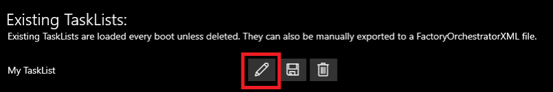
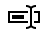
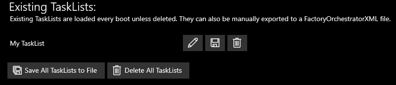
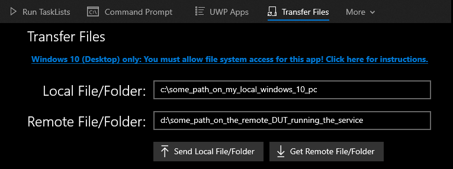

<!-- Copyright (c) Microsoft Corporation. -->
<!-- Licensed under the MIT license. -->

# Use the Factory Orchestrator app
The app is a Windows-only app and it depends on the service to run. However, it can connect to a service running on any DUT on your local network, not just to the same device the app is running on. This includes connecting to a DUT running Linux!

## Run a TaskList
When you first run the Factory Orchestrator app, you're presented with the 'Run TaskLists' tab. If you're opening the app for the first time, the app likely won't show any TaskLists. Once you create a TaskList, it will show up on this screen.

Once you've [created or imported a TaskList into Factory Orchestrator, you can run it](#managing-tasklists). This topic covers the process of running a TaskList.

When you click on the **Run TaskLists** menu item, you'll be see the "Run TaskLists" screen.

Hit the 'Play' button to run a TaskList. As tasks complete, the tasks' output will show next to the task.

While a TaskList is running, the Factory Orchestrator service will continue to run the tasks, even if you close the Factory Orchestrator app.

If you're running a task or a tasklist, the Factory Orchestrator UI allows you to easily monitor the status of any running task by displaying task status. You can disable this task status display by going to the **Run TaskLists** page and unchecking **Track Execution**.

As tasks complete, the Tasks' output will show next to the Task. While a TaskList is running, the Factory Orchestrator service will continue to run the tasks, even if you close the Factory Orchestrator app. A running TaskList can be "Aborted" by clicking the 'Pause' button.

If a TaskList is aborted you can either click the 'Play' button to resume executing it or the 'Re-run' button to restart the TaskList from the beginning.

A 'Re-run' button will also appear next to a Task if the TaskList is done executing and that Task failed. Press that button to retry the failed Task.

If you click on a Task, the results page will load and show you the status of the latest "run" ([TaskRun](../CoreLibrary/Microsoft-FactoryOrchestrator-Core-TaskRun/)) of that Task, including the any output of the Task. The results page also allows you to see the log file path for that run. You can also use the buttons at the top of the page to view older or newer runs of the Task, provided it has been run multiple times.

## Managing TaskLists

You can use the Factory Orchestrator app to manage a [TaskList](tasks-and-tasklists.md). To create, modify, and delete TaskLists, click on 'Manage TaskLists'.

### Create and manage TaskLists

The 'Manage TaskLists' tab in the Factory Orchestrator app allows you to create, modify, and delete TaskLists.

#### Create or import TaskLists

- **Add a whole folder as a TaskList**

    Adds the contents of a local folder into a new TaskList. After you've added a folder, you can edit individual tasks to configure additional arguments, timeout settings, etc.

    

- **Choose individual files to add to a TaskList**

    Use `Create new TaskList` to create a new [TaskList](../CoreLibrary/Microsoft-FactoryOrchestrator-Core-TaskList/) where you can individual tasks one-at-a-time to your TaskList. When you add tasks this way, you choose the type of task that you're adding and can configure arguments, timeout settings, etc as you add tasks.

    

- **Import a previously generated FactoryOrchestratorXML file**

    This enables you to generate and export a TaskList on one device, and import it into your device. Once loaded, imported TaskList XML files can be modified like any other Task List.

    To import a TaskList:

    1. On the **Manage TaskLists** page, click on **Import FactoryOrchestratorXML file**
      

    2. Enter the full path to the FactoryOrchestratorXML you want to import and click ✓

      

    When you import a TaskList:

  - All the TaskLists defined in the file are imported
  - If the TaskList(s) were previously run, the TaskList state is also imported but not Task run results

When you create a new TaskList, the Factory Orchestrator app generates a GUID that it assigns as the TaskList's name.

#### Create and modify TaskLists

Once you've added tasks to a TaskList, you can click the pencil icon to modify as TaskList.

When you click the pencil icon, you'll see the following screen:

This screen allows you to create new Tasks, rename existing Tasks, reorder Tasks, or edit Tasks.

- Use the "New `<TaskType>` Task" buttons to create a new Task in the TaskList

- Use the rename icon () to rename TaskLists

- Click and drag on the bars to the left of a Task to reorder the Tasks.

- Use the pencil (edit) button to edit a task. When you click the edit or "New `<TaskType>` Task" buttons, you'll see something similar to:

    

    See [FactoryOrchestratorXML](tasks-and-tasklists.md) for information about the different options on this screen.

- Use the delete buttons to delete an existing Task.

#### Export TaskLists

If you create one or more TaskLists in the app, you can export and save them. This allows you to import them onto another device. From the 'Manage TaskLists" screen:

- Save a single TaskList by clicking on the disk icon next to the TaskList name
- Save all your TaskLists by clicking on the button that says 'Save All TaskLists to XML File`

To export TaskLists:

Here is an image of the **Manage TaskLists** page with one TaskList loaded:

From this page, you can:

- Export a specific TaskList by clicking on the save icon (./images/save-icon.png) next to the Task
- Export all TaskLists by clicking on the **Save All TaskLists to File** button.

After you click one of these buttons, enter the full path of the file to save and click the (✓) to confirm.

# Factory Orchestrator utilities

The Factory Orchestrator app also includes some basic utilities intended as a starting point for integration into a manufacturing line, fault analysis workflow or developer inner loop.

## UWP Apps (Windows only)

This launches a UWP app that's installed on a device under test (DUT). This allows you to launch a UWP directly from the Factory Orchestrator app by clicking on its name in the list of installed UWP apps.

See [here](get-started-with-factory-orchestrator.md#windows-uwp-app-support) for setup requirments.

## Windows Device Portal (Windows only)

This launches [Windows Device Portal](https://docs.microsoft.com/en-us/windows/uwp/debug-test-perf/device-portal).

See [here](get-started-with-factory-orchestrator.md#windows-uwp-app-support) for setup requirments.

## Command Prompt

A basic and non-interactive command prompt that allows you to troubleshoot without having to use other methods like SSH or Windows Device Portal to connect to your DUT.

While you can run commands and see output when using the built-in command prompt in Factory Orchestrator, it's not an interactive shell. If you run a command that requires additional input, you won't be able to enter the additional input.

## File Transfer

A very basic file transfer function that enables you to transfer files & folders to and from your device when you're connected from a Windows PC. This feature is not visible in the Factory Orchestrator app when running the app and service on the same device (the "Transfer Files" tab will be hidden).

### One-time setup for file transfer

First, [install the Factory Orchestrator app](get-started-with-factory-orchestrator.md#install-the-app) on a Windows system that is __not running the Factory Orchestrator service__.

Next, you need to give the Factory Orchestrator app full file system access for file transfer to work. Follow the directions on the [Windows 10 file system access and privacy](https://support.microsoft.com/en-us/help/4468237/windows-10-file-system-access-and-privacy-microsoft-privacy) page to give the Factory Orchestrator app access to your local file system. You may need to launch the app at least once before it appears on the Settings app.

### Send a file or folder to a DUT

- From your local Windows PC, launch the Factory Orchestrator app and connect to the IP address of the remote DUT.
- Navigate to "Transfer Files". This tab is only visible if you are connected to a remote DUT.
- In the "Local File/Folder" textbox, enter the full path to a file or folder on your local Windows PC.
- In the "Remote File/Fikder" textbox, enter the full path of where you wish the file or folder to be saved on the DUT. Make sure the location you're saving to is writeable.
- Click "Send Local File/Folder" to transfer the file or folder from the Windows PC to the DUT.

### Receive a file or folder from your DUT

- From your local Windows PC, launch the Factory Orchestrator app and connect to the IP address of the remote DUT.
- Navigate to "Transfer Files". This tab is only visible if you are connected to a remote DUT.
- In the "Remote File/Folder" textbox, enter the full path of to a file or folder you wish to copy from the DUT.
- In the "Local File/Folder" textbox, enter the full path of where you wish the file or folder to be saved on your local Windows PC. Make sure the location you're saving to is writeable.
- Click "Get Remote File/Folder" to transfer the file or folder from the DUT to your local Windows 10 PC.
